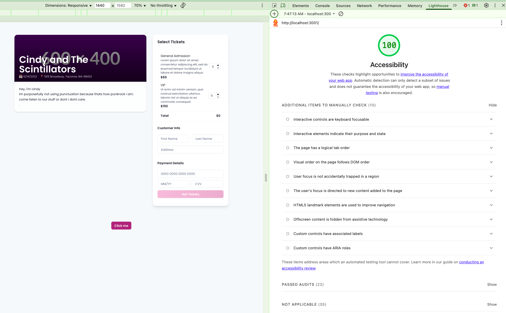

# Create a form for touring bands!

This homework is completed in an iterative style where each iteration is represented as its own commit.

# Rationale

## 1. Data Access (Repository Layer)

* **`repositories/event/event.ts`**: exposes a single `getEventById(id)` that under the hood switches between:

  * **`repositories/event/mock.ts`** for local JSON fixtures (synchronous lookup, error-throwing)
  * **`repositories/event/production.ts`** for real `fetch(...)` calls (stubbed API client)
* **Barrel** (`repositories/event/index.ts`): re-exports `getEventById` based on `NODE_ENV`.
* **Benefit:** Consumers import from one path (“`repositories/event`”) and automatically get either mocks or the stubbed production client—no changes needed in hooks or components.

---

## 2. Business Logic (Service Layer)

* **`services/ticketing/event.ts`**: wraps the repo call, converts raw timestamps to `Date` objects.
* **`services/ticketing/order.ts`**: enforces purchase rules (e.g. at least one ticket selected) before delegating to a repository.
* **Barrel** (`services/ticketing/index.ts`): re-exports `fetchEvent` and `submitOrder` for use in hooks.
* **Benefit:** All domain-specific transformations and validations live here, keeping UI and data layers clean and consistent.

---

## 3. State Management (Hooks Layer)

* **`useEvent(eventId)`**: manages `loading` / `error` / `data` state around `fetchEvent(...)`, plus a `refetch` callback.
* **`useSubmitOrder()`**: manages `submitting` / `confirmation` / `error` around `submitOrder(...)`, exposing a simple `submit()` function.
* **Pattern:** Hooks isolate all async side-effects and state—components remain pure, declarative functions.
* **Benefit:** Reusable, testable hooks encapsulate network logic and error handling, so component code stays straightforward.

---

## 4. Presentation (Components + Chakra UI)

* **ChakraProvider** at the app root supplies theme tokens (fonts, colors, radii, global styles).
* Core UI lives in “cards” (`<Box bg="white" shadow rounded p>`):

  * **`EventPage`** — 2:1 Flex layout combining BandInfo, TicketSelection, CustomerForm, PaymentForm.
  * **`BandInfo`**, **`TicketSelection`**, **`CustomerForm`**, **`PaymentForm`** — each styled via Chakra props, with responsive layouts.
  * **`Fabululu`** — an interactive CTA with hover shake and click-to-popup animation.
* **Accessibility & Polish:**

  * `srOnly` labels on inputs, WCAG-compliant contrast ratios, `<Spinner>` for loading, `<Alert>` for errors.
  * Consistent spacing, hover states, and responsive adjustments baked into Chakra props.

---

### Why It Works

* **Clear boundaries:** Repos → Services → Hooks → Components.
* **Easy testing:** Swap mocks at the repo layer; unit-test service logic in isolation.
* **Scalable UI:** Chakra’s theme ensures consistency and speeds up styling.
* **High developer DX:** Focus on features and flows, not boilerplate CSS or tangled async code.

